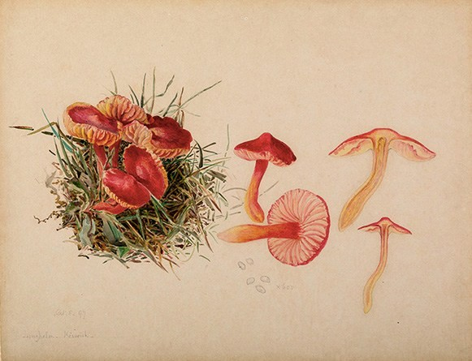

Beatrix Potter's parents did not discourage higher education. As was common in the Victorian era, women of her class were privately educated and rarely went to university.

::: {.embed-right}
{width="250"}
:::

Beatrix Potter was interested in every branch of natural science save astronomy. Botany was a passion for most Victorians and nature study was a popular enthusiasm. Potter was eclectic in her tastes: collecting fossils, studying archaeological artefacts from London excavations, and interested in entomology. In all these areas, she drew and painted her specimens with increasing skill. By the 1890s, her scientific interests centred on mycology. First drawn to fungi because of their colours and evanescence in nature and her delight in painting them, her interest deepened after meeting Charles McIntosh, a revered naturalist and amateur mycologist, during a summer holiday in Dunkeld in Perthshire in 1892. He helped improve the accuracy of her illustrations, taught her taxonomy, and supplied her with live specimens to paint during the winter. Curious as to how fungi reproduced, Potter began microscopic drawings of fungus spores (the agarics) and in 1895 developed a theory of their germination. Through the connections of her uncle Sir Henry Enfield Roscoe, a chemist and vice-chancellor of the University of London, she consulted with botanists at Kew Gardens, convincing George Massee of her ability to germinate spores and her theory of hybridisation.[30] She did not believe in the theory of symbiosis proposed by Simon Schwendener, the German mycologist, as previously thought; instead, she proposed a more independent process of reproduction.

> "Potter was, nevertheless, a pioneering mycologist, one whose intelligence and inquisitiveness might have been channeled into a career in science had she possessed the Y chromosome required for most Victorian professions. Fortunately, her considerable artistic talents gave her other outlets for her ambition."
>
> --- Nicholas P. Money

Rebuffed by William Thiselton-Dyer, the Director at Kew, because of her sex and her amateur status, Beatrix wrote up her conclusions and submitted a paper, On the Germination of the Spores of the Agaricineae, to the Linnean Society in 1897. It was introduced by Massee because, as a female, Potter could not attend proceedings or read her paper. She subsequently withdrew it, realising that some of her samples were contaminated, but continued her microscopic studies for several more years. Her paper has only recently been rediscovered, along with the rich, artistic illustrations and drawings that accompanied it. Her work is only now being properly evaluated. Potter later gave her other mycological and scientific drawings to the Armitt Museum and Library in Ambleside, where mycologists still refer to them to identify fungi. There is also a collection of her fungus paintings at the Perth Museum and Art Gallery in Perth, Scotland, donated by Charles McIntosh. In 1967, the mycologist W.P.K. Findlay included many of Potter's beautifully accurate fungus drawings in his Wayside & Woodland Fungi, thereby fulfilling her desire to one day have her fungus drawings published in a book. In 1997, the Linnean Society issued a posthumous apology to Potter for the sexism displayed in its handling of her research.

Read more: <https://www.smithsonianmag.com/arts-culture/bedtime-reading-from-beatrix-potter-amateur-mycologist-88892658/>
